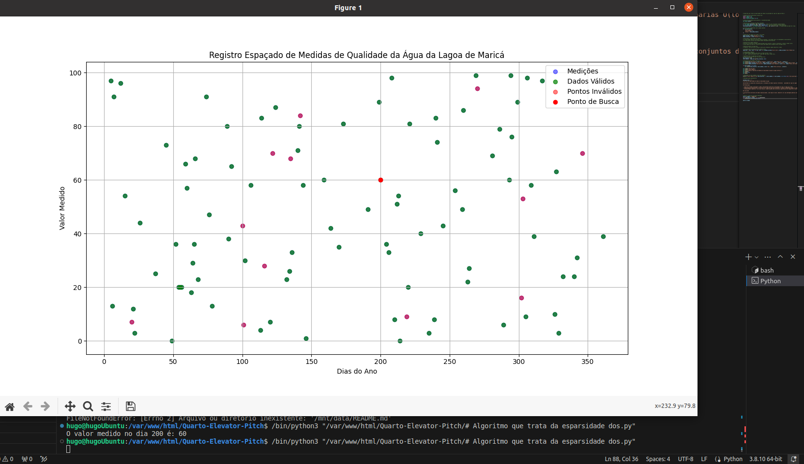

# Análise de Esparsidade em Dados de Qualidade da Água

Apresentamos um algoritmo otimizado para o tratamento de dados esparsos referentes à qualidade da água da Lagoa de Maricá.

## Metodologia

- **Geração de Dados Simulados**: Dados representando medições de qualidade da água ao longo de um ano.
- **Estratégia de Otimização**: Utilização de um mapa de hash para armazenar e acessar rapidamente apenas as medições válidas.
- **Complexidade Temporal**: O(1) para buscas, proporcionando uma eficiência significativa em comparação a buscas lineares simples O(n) ou buscas binárias O(log n), especialmente considerando a natureza esparsa dos dados.

## Análise de Complexidade

A utilização de estruturas de dados especializadas, como mapas de hash, demonstra ser uma abordagem poderosa para otimizar algoritmos que operam em conjuntos de dados com alta esparsidade. A complexidade sintótica, O(1) para buscas no mapa de hash, é significativamente mais eficiente do que O(n) para uma busca linear e O(log n) para uma busca binária.

Isso significa que, independentemente do tamanho do conjunto de dados, o tempo para encontrar um elemento é constante no mapa de hash. Por outro lado, a complexidade assintótica reflete o comportamento do algoritmo à medida que o conjunto de dados se aproxima de um tamanho infinito, garantindo que o desempenho não degrada com conjuntos de dados extremamente grandes.

A otimização sintótica e assintótica é crucial para conjuntos de dados grandes e esparsos como o apresentado, onde a maioria das medições pode não ser válida, e uma busca eficiente é essencial para o desempenho.

## Conclusão

A abordagem proposta é ideal para cenários onde o acesso rápido a dados válidos é primordial e onde os dados inválidos são comuns. A visualização dos resultados ajuda a destacar a eficiência da abordagem adotada, mostrando uma clara distinção entre dados válidos e inválidos e o sucesso na rápida localização de dados específicos em um conjunto de dados esparsos.

# Agradecimentos

Um agradecimento especial ao **Prof. Marcio Garrido**, cuja orientação e conhecimento em engenharia de software, IoT e Data Science foram fundamentais para o desenvolvimento deste projeto. Com uma ampla experiência acadêmica e profissional em sistemas de informação e desenvolvimento de sistemas, Prof. Garrido é uma inspiração contínua e um recurso valioso para qualquer aluno. Para mais informações sobre suas qualificações e contribuições, consulte o [currículo Lattes](http://lattes.cnpq.br/7310316924480839) dele.
